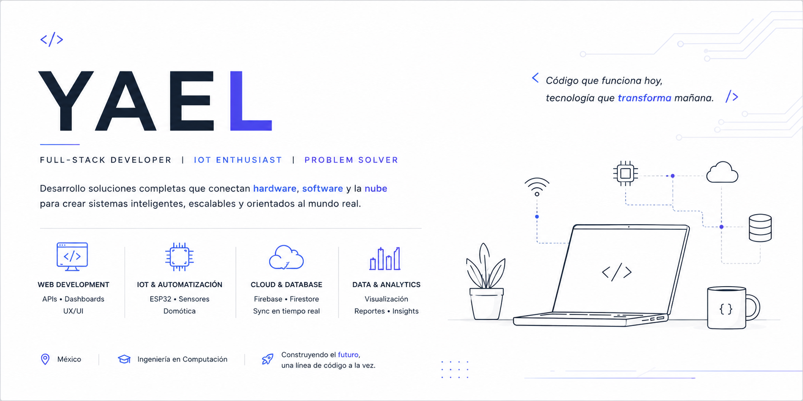

<!-- ===================== BANNER ===================== -->

  

<!-- ===================== TITLE ===================== -->
<h1 align="center">
  Hi, I'm Yael 👋
</h1>

  

  <strong>Full-Stack Developer • IoT Developer • Cloud Integrator</strong>

  Passionate about building complete systems that connect <b>software</b>, <b>hardware</b> and the <b>cloud</b>.

---

## 💻 About Me

I'm **Yael**, a Computer Engineering student focused on building modern software solutions with a strong interest in **full-stack development**, **IoT**, and **cloud integration**.

I enjoy developing projects that include real-time data processing, dashboards, scalable backend architectures, and hardware communication using embedded systems like ESP32.

---

##  Tech Stack

  <!-- Languages -->
  
  
  

  <!-- Frontend -->
  
  
  
  
  

  <!-- Backend -->
  
  
  
  

  <!-- Database / Cloud -->
  
  
  

  <!-- DevOps / Deploy -->
  
  

  <!-- IoT -->
  
  

  <!-- OS -->
  
  

---

##  Featured Projects

### 🧪 LabStock
 **Laboratory Inventory Management System**  
 Repo: https://github.com/Yael-pv10/LabStock

A complete system to manage laboratory inventory, loans, maintenance, and reporting with real-time updates.

**Main Features**
- Role-based system (Admin, Teacher, Technician, Student)
- Real-time updates with Socket.IO
- PDF and Excel report generation
- PostgreSQL database integration
- Secure authentication and sessions

**Tech Stack:** Node.js, Express, PostgreSQL, Socket.IO, PDFKit, ExcelJS

---

###  SmartBiz Control (Frontend)
📦 **Enterprise Management Frontend**  
🔗 Repo: https://github.com/SmartBiz-Control/Frontend_SmartBiz_Control

Angular frontend designed for business control and enterprise management.

**Tech Stack:** Angular, TypeScript, HTML, CSS

---

###  GameNasaFarm
📦 **Interactive Game Project**  
🔗 Repo: https://github.com/Yael-pv10/GameNasaFarm

A creative project based on interactive game logic and simulation concepts.

---

##  Pinned Repositories (Recommended)

<table>
  <tr>
    <td width="33%" valign="top">
      <h3>🧪 LabStock</h3>
      

        Laboratory inventory & loan management system with real-time updates and reporting.
      

      

        <b>Tech:</b> Node.js, Express, PostgreSQL, Socket.IO
      

      <a href="https://github.com/Yael-pv10/LabStock">🔗 View Repository</a>
    </td>

    <td width="33%" valign="top">
      <h3>💼 SmartBiz Control</h3>
      

        Enterprise-focused Angular frontend designed for business administration and control.
      

      

        <b>Tech:</b> Angular, TypeScript, HTML, CSS
      

      <a href="https://github.com/SmartBiz-Control/Frontend_SmartBiz_Control">🔗 View Repository</a>
    </td>

    <td width="33%" valign="top">
      <h3>🎮 GameNasaFarm</h3>
      

        Interactive game project inspired by simulation concepts and creative challenges.
      

      

        <b>Tech:</b> JavaScript (update later)
      

      <a href="https://github.com/Yael-pv10/GameNasaFarm">🔗 View Repository</a>
    </td>
  </tr>
</table>

---

## 🗺️ Roadmap (Currently Learning)

- React & Next.js
- Advanced TypeScript
- CI/CD Pipelines
- Flutter Mobile Development
- Cloud Architecture & Scalability
- Better system design patterns for Full-Stack apps

---

##  GitHub Stats

  
  

---

##  Let's Connect

  

  

---

⭐ *Profile README constantly updated as I build new projects and improve my stack.*

